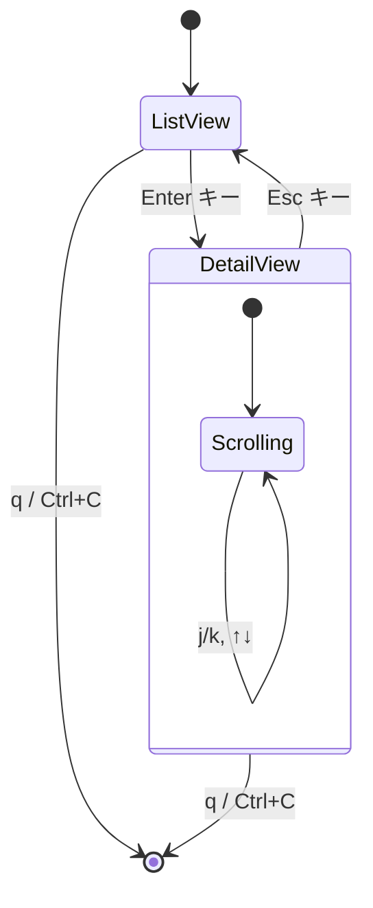

# Design Document

## Overview

Spec 詳細ビュー機能は、既存の kiro-radar TUI アプリケーションに新しい画面モードを追加します。現在のリスト表示（ListView）に加えて、選択された Spec の詳細情報を表示する詳細ビュー（DetailView）を実装します。

この機能により、ユーザーは requirements.md、design.md、tasks.md の内容を TUI 内で直接閲覧でき、外部エディタを開くことなく Spec の全体像を把握できるようになります。

## Architecture

### 状態管理の拡張

現在の `App` 構造体を拡張し、ビューモードの概念を導入します：

```rust
pub enum ViewMode {
    List,
    Detail { spec_index: usize },
}

pub struct App {
    pub running: bool,
    pub spec_sets: Vec<SpecSet>,
    pub list_state: ListState,
    pub view_mode: ViewMode,           // 新規追加
    pub detail_scroll: usize,          // 新規追加
}
```

### モジュール構成

既存のモジュール構成を維持しつつ、以下を拡張：

- **app.rs**: ViewMode の管理、詳細ビューへの遷移ロジック
- **events.rs**: ViewMode に応じたキーイベント処理の分岐
- **ui.rs**: ViewMode に応じたレンダリング処理の分岐
- **spec/reader.rs** (新規): Spec ファイルの読み込みロジック

### イベントフロー



## Components and Interfaces

### ViewMode 列挙型

ビューの状態を表現する列挙型：

```rust
#[derive(Debug, Clone, PartialEq)]
pub enum ViewMode {
    List,
    Detail { spec_index: usize },
}
```

### App 構造体の拡張

```rust
pub struct App {
    pub running: bool,
    pub spec_sets: Vec<SpecSet>,
    pub list_state: ListState,
    pub view_mode: ViewMode,
    pub detail_scroll: usize,
}
```

新規フィールド：

- `view_mode`: 現在のビューモード
- `detail_scroll`: 詳細ビュー内のスクロール位置（行単位）

新規メソッド：

- `enter_detail_view()`: 詳細ビューに遷移
- `exit_detail_view()`: リストビューに戻る
- `scroll_down()`: 詳細ビューを下にスクロール
- `scroll_up()`: 詳細ビューを上にスクロール

### SpecContent 構造体（新規）

Spec ファイルの内容を保持する構造体：

```rust
pub struct SpecContent {
    pub requirements: Result<String, String>,
    pub design: Result<String, String>,
    pub tasks: Result<String, String>,
}
```

各フィールドは `Result<String, String>` 型で、成功時はファイル内容、失敗時はエラーメッセージを保持します。

### spec/reader.rs（新規モジュール）

Spec ファイルを読み込む責務を持つモジュール：

```rust
pub fn read_spec_content(spec_set: &SpecSet) -> SpecContent
```

- 各ファイル（requirements.md、design.md、tasks.md）の読み込みを試行
- ファイルが存在しない場合やエラーの場合は適切なエラーメッセージを返す
- IO エラーは `Result` のエラー側に格納

## Data Models

### ViewMode

```rust
pub enum ViewMode {
    List,
    Detail { spec_index: usize },
}
```

### SpecContent

```rust
pub struct SpecContent {
    pub requirements: Result<String, String>,
    pub design: Result<String, String>,
    pub tasks: Result<String, String>,
}
```

### App（拡張後）

```rust
pub struct App {
    pub running: bool,
    pub spec_sets: Vec<SpecSet>,
    pub list_state: ListState,
    pub view_mode: ViewMode,
    pub detail_scroll: usize,
}
```

## Correctness Properties

_A property is a characteristic or behavior that should hold true across all valid executions of a system-essentially, a formal statement about what the system should do. Properties serve as the bridge between human-readable specifications and machine-verifiable correctness guarantees._

### Property Reflection

以下のプロパティの冗長性を分析しました：

**統合可能なプロパティ:**

- 2.1, 2.3, 3.1（各ファイルの内容表示）→ 単一のプロパティ「ファイル内容表示」に統合
- 2.5, 3.4（スクロール可能状態）→ 重複のため 3.4 を削除
- 4.1, 4.2（スクロール動作）→ 単一のプロパティ「スクロール操作」に統合

**エッジケースとして扱うもの:**

- 4.3, 4.4（境界条件）→ プロパティテストのジェネレータで処理

**残すプロパティ:**
上記の統合後、以下の独立したプロパティを定義します。

### Correctness Properties

Property 1: ビューモード遷移の正確性
_For any_ 有効な Spec インデックスに対して、リストビューで Enter キーイベントを処理すると、ViewMode が Detail { spec_index } に変更される
**Validates: Requirements 1.1, 7.3**

Property 2: ビューモード復帰の正確性
_For any_ 詳細ビュー状態に対して、Esc キーイベントを処理すると、ViewMode が List に変更される
**Validates: Requirements 5.1**

Property 3: 選択状態の保持（Round-trip）
_For any_ 選択インデックスに対して、詳細ビューへの遷移と復帰を行っても、リストの選択インデックスは変更されない
**Validates: Requirements 5.2**

Property 4: スクロール位置の初期化
_For any_ スクロール位置に対して、詳細ビューに遷移すると、detail_scroll が 0 にリセットされる
**Validates: Requirements 1.3**

Property 5: スクロール位置のクリア
_For any_ スクロール位置に対して、リストビューに戻ると、detail_scroll が 0 にリセットされる
**Validates: Requirements 5.3**

Property 6: スクロール操作の動作
_For any_ 有効なスクロール位置（0 < position < max）に対して、下キーイベントでスクロール位置が増加し、上キーイベントでスクロール位置が減少する
**Validates: Requirements 4.1, 4.2**

Property 7: ファイル内容の表示
_For any_ 存在する Spec ファイル（requirements.md、design.md、tasks.md）に対して、詳細ビューのレンダリング結果にそのファイルの内容が含まれる
**Validates: Requirements 2.1, 2.3, 3.1**

Property 8: エラーメッセージの表示
_For any_ 読み込みに失敗した Spec ファイルに対して、詳細ビューのレンダリング結果にエラーメッセージが含まれる
**Validates: Requirements 8.1, 8.3**

Property 9: Spec 名の表示
_For any_ Spec に対して、詳細ビューのレンダリング結果にその Spec の名前が含まれる
**Validates: Requirements 1.2**

Property 10: キーバインド情報の表示
_For any_ 詳細ビュー状態に対して、レンダリング結果にキーバインド情報が含まれる
**Validates: Requirements 6.1**

Property 11: 終了操作の動作
_For any_ ビューモード（List または Detail）に対して、q キーまたは Ctrl+C イベントを処理すると、running フラグが false になる
**Validates: Requirements 6.3**

Property 12: ViewMode に応じたレンダリング分岐
_For any_ App 状態に対して、ViewMode が List の場合はリストビューがレンダリングされ、ViewMode が Detail の場合は詳細ビューがレンダリングされる
**Validates: Requirements 7.2**

## Error Handling

### ファイル読み込みエラー

Spec ファイルの読み込み時に発生する可能性のあるエラー：

1. **ファイル不在**: `Option<PathBuf>` が `None` の場合
   - 対応: "File not found" メッセージを表示
2. **IO エラー**: ファイル読み込み時の権限エラーなど

   - 対応: エラー内容を含むメッセージを表示（例: "Error reading file: Permission denied"）

3. **UTF-8 デコードエラー**: ファイルが有効な UTF-8 でない場合
   - 対応: "Invalid UTF-8 encoding" メッセージを表示

### エラーハンドリング戦略

```rust
pub fn read_spec_file(path: &Option<PathBuf>) -> Result<String, String> {
    match path {
        None => Err("File not found".to_string()),
        Some(p) => {
            std::fs::read_to_string(p)
                .map_err(|e| format!("Error reading file: {}", e))
        }
    }
}
```

エラーは `Result<String, String>` で表現し、UI レンダリング時にエラーメッセージを表示します。

### パニックの回避

- すべてのファイル操作は `Result` 型で処理
- 配列アクセスは境界チェック済みのインデックスのみ使用
- `unwrap()` の使用を避け、適切なエラーハンドリングを実施

## Testing Strategy

### ユニットテスト

以下の具体的なケースをユニットテストで検証：

1. **初期状態のテスト**

   - App::new() が ViewMode::List で初期化されること
   - detail_scroll が 0 で初期化されること

2. **エッジケースのテスト**

   - スクロール位置が 0 の時に上スクロールしても変化しないこと
   - スクロール位置が最大値の時に下スクロールしても変化しないこと
   - コンテンツが短い場合にスクロールが無効化されること

3. **エラーメッセージのテスト**
   - ファイルが存在しない場合に "File not found" が表示されること
   - 特定のキーバインド文字列が表示されること

### プロパティベーステスト

プロパティベーステストには **quickcheck** クレート（v1.0）を使用します。

各プロパティテストは以下の形式で実装：

```rust
#[quickcheck]
fn property_name(input: ArbitraryType) -> bool {
    // テストロジック
}
```

**設定:**

- 各プロパティテストは最低 100 回の反復を実行
- テスト失敗時は反例を出力

**タグ付け規則:**
各プロパティベーステストには、対応する設計ドキュメントのプロパティを明示するコメントを付与：

```rust
// **Feature: spec-detail-view, Property 1: ビューモード遷移の正確性**
#[quickcheck]
fn test_view_mode_transition(spec_index: usize) -> bool {
    // テストロジック
}
```

**実装するプロパティテスト:**

1. Property 1: ビューモード遷移の正確性
2. Property 2: ビューモード復帰の正確性
3. Property 3: 選択状態の保持（Round-trip）
4. Property 4: スクロール位置の初期化
5. Property 5: スクロール位置のクリア
6. Property 6: スクロール操作の動作
7. Property 7: ファイル内容の表示
8. Property 8: エラーメッセージの表示
9. Property 9: Spec 名の表示
10. Property 10: キーバインド情報の表示
11. Property 11: 終了操作の動作
12. Property 12: ViewMode に応じたレンダリング分岐

### テスト対象モジュール

- **app.rs**: 状態遷移、スクロール操作のロジック
- **events.rs**: キーイベント処理の分岐
- **ui.rs**: レンダリング結果の検証（文字列マッチング）
- **spec/reader.rs**: ファイル読み込みとエラーハンドリング

## Implementation Notes

### UI レイアウト設計

詳細ビューは以下のレイアウトで構成：

```
┌─────────────────────────────────────────┐
│ [ KIRO RADAR - 0.1.0 ]                  │ ← ヘッダー
├─────────────────────────────────────────┤
│ Spec: {spec_name}                       │ ← Spec 名
├─────────────────────────────────────────┤
│ ┌─ Requirements ─────────────────────┐  │
│ │ {requirements.md の内容}           │  │
│ │ ...                                │  │
│ └────────────────────────────────────┘  │
│ ┌─ Design ───────────────────────────┐  │
│ │ {design.md の内容}                 │  │ ← スクロール可能
│ │ ...                                │  │
│ └────────────────────────────────────┘  │
│ ┌─ Tasks ────────────────────────────┐  │
│ │ - [x] 完了タスク                   │  │
│ │ - [ ] 未完了タスク                 │  │
│ └────────────────────────────────────┘  │
├─────────────────────────────────────────┤
│ [ ↑/k: Up, ↓/j: Down, Esc: Back, q: Quit ]│ ← フッター
└─────────────────────────────────────────┘
```

### スクロール実装

- `detail_scroll` フィールドで現在のスクロール位置（行番号）を管理
- レンダリング時に `detail_scroll` から表示可能行数分のコンテンツを切り出し
- スクロール可能な最大位置 = 総行数 - 表示可能行数

### パフォーマンス考慮事項

- ファイル読み込みは詳細ビューへの遷移時に一度だけ実行
- 大きなファイルの場合、スクロール時の再レンダリングコストを最小化
- 文字列の分割は `lines()` イテレータを使用して効率的に処理

### 将来の拡張性

- タブ切り替え機能（Requirements / Design / Tasks を個別に表示）
- 検索機能（ファイル内容の全文検索）
- タスクの編集機能（チェックボックスの切り替え）
- シンタックスハイライト（Markdown のレンダリング）
